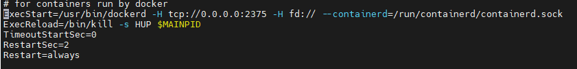

## runcode

添加小助手微信进入微信交流群


在线运行代码编辑器

语言支持度

- C++ 11

- C

- Java

- Rust lts

- Nodejs lts

- Go lts

- C# lts

- Python3

- php

代码格式化支持

- C++

- C

- Java

- Nodejs

## Js-challenges

前端编程题挑战

## 创建题目

在项目根目录下运行

```sh
pnpm qs:create <你的题目名>

# 例如我创建 demo 题目
pnpm qs:create demo
```

运行完之后会在 question/FrontEnd 目录下生成以下文件

- demo
  - answer.md
  - answer.mjs
  - index.md
  - index.mjs
  - test.mjs

## 生成静态文件

在项目根目录下运行

```sh
pnpm qs:generate
```

运行后会在 server 目录下生成 qs.json 文件

然后启动服务端, 服务端 数据来源于 qs.json

## 开发

前置条件

nodejs >= 14.20.0

包管理工具 pnpm 安装

```sh
npm install pnpm -g
```

### server

- koa + typescript + dockerode

1. 构建镜像

前置条件, 安装了 docker, docker 需要设置端口 为 2375

在 centos 7 端口修改方法:
在配置文件里 ExecStart=/usr/bin/dockerd 这串后面加上 -H tcp://0.0.0.0:2375 , 然后重启 docker
我的配置文件在 /usr/lib/systemd/system/docker.service 这个路径
配置文件示例



未构建的镜像, 在编辑器里 run 代码时会报镜像 404, 所以开发过程中无需全部构建, 构建需要的语言环境即可

- 构建 C++ 镜像

  ```bash
    cd server/src/docker/cpp
    docker build -t cpp:11 .
  ```

- 构建 rust 镜像

  ```bash
    cd server/src/docker/rust
    docker build -t rust:lts .
  ```

- 构建 python3 镜像

  ```bash
    cd server/src/docker/python3
    docker build -t python:3 .
  ```

- 构建 python2 镜像

  ```bash
    cd server/src/docker/python2
    docker build -t python:2 .
  ```

- 构建 go 镜像

  ```bash
    cd server/src/docker/go
    docker build -t go:lts .
  ```

- 构建 nodejs 镜像

  ```bash
    cd server/src/docker/nodejs
    docker build -t nodejs:lts .
  ```

- 构建 java 镜像

  ```bash
    cd server/src/docker/java
    docker build -t java:lts .
  ```

- 构建 C# 镜像

  ```bash
    cd server/src/docker/dotnet
    docker build -t mono:lts .
  ```

- 构建 php 镜像

  ```bash
    cd server/src/docker/php
    docker build -t php:8 .
  ```

2. 安装依赖

   ```sh
   cd server
   pnpm i
   ```

3. 启动

   ```sh
   pnpm dev
   ```

### client

- vite + react + typescript + antd

- UI

  tailwindcss, 原子化 css, 在个人项目里使用优势很大, 节省时间、代码

  且都支持按需引入, 体积更小

- 状态管理

  mobx、mobx-react-lite、mobx-persist-store

- 编辑器使用 monaco-editor

  高亮、输入提示、部分语言代码格式化、多主题

  引入 clang-format wasm 模块实现 C/C++/Java 语言的代码格式化

1. 安装依赖

   ```sh
   cd client
   pnpm i
   ```

2. 编译 tailwindcss

   ```sh
   # 启动后另开终端启动服务
   pnpm build:tailwind:watch
   ```

3. 启动服务

   ```sh
   # 起开发环境,需要起 server
   pnpm dev
   # 起生产环境
   pnpm prod
   ```

## 部署

### server

1. 服务端环境

- nodejs
- pm2
- docker
- pnpm

2. 编译

进入 server 目录

```sh
cd server
pnpm i
pnpm build
```

3. 启动服务

```sh
pnpm deploy
```

### client

进入 client 目录

1. 安装依赖

```sh
pnpm i
```

2. 构建

```sh
pnpm build
```

3. 使用 nginx 代理静态资源, 构建好的静态资源在 dist 目录下

主要是 html 文件, 其他静态资源部署到我的 cdn 上了

## commit 规范

- feat：新功能（feature）
- fix：修补 bug
- docs：文档（documentation），只改动了文档部分
- style： 格式（不影响代码运行的变动），例如去掉空格、改变缩进
- refactor：重构（即不是新增功能，也不是修改 bug 的代码变动）
- test：添加测试或者修改现有测试
- chore：构建过程或辅助工具的变动
- perf：提高性能的改动
- ci：自动化流程配置修改、与 CI（持续集成服务）有关的改动
- revert：回滚到上一个版本，执行 git revert 打印的 message
